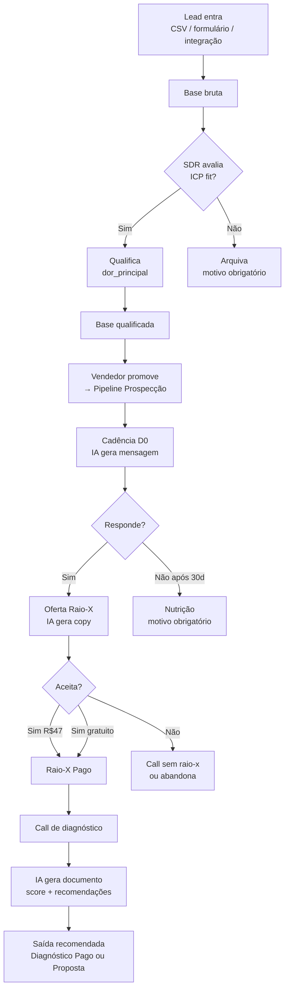
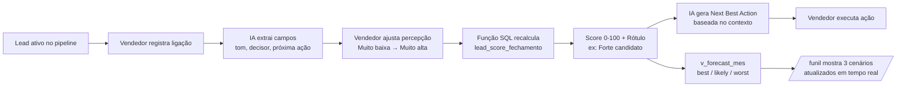
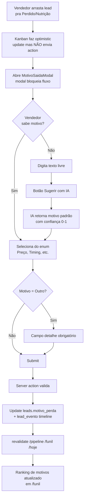
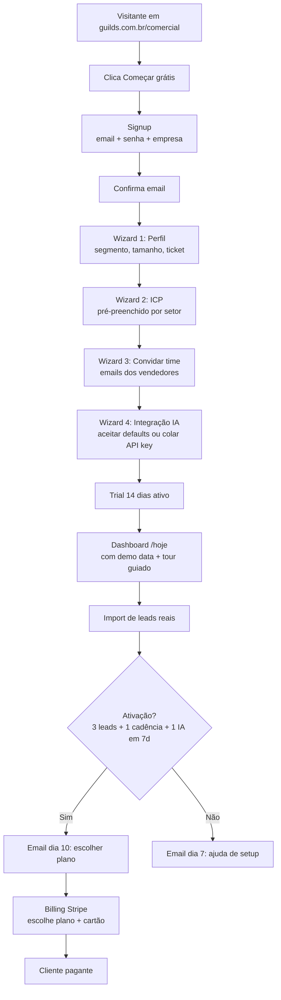
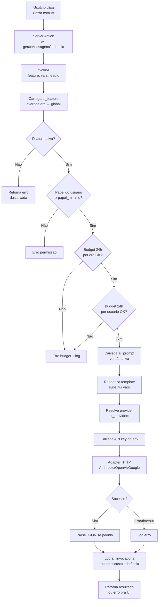

# PRD — Guilds Comercial
## Plataforma SaaS de CRM + Copiloto de IA para times comerciais B2B

**Versão:** 1.0 · **Data:** 2026-04-23 · **Autor:** Gustavo (CMO/Fundador — Guilds Lab) · **Status:** Draft para validação interna

---

## Sumário

1. [Sumário executivo](#1-sumário-executivo)
2. [Visão e problema](#2-visão-e-problema)
3. [Posicionamento e diferenciação](#3-posicionamento-e-diferenciação)
4. [Cliente ideal (ICP)](#4-cliente-ideal-icp)
5. [Proposta de valor](#5-proposta-de-valor)
6. [Escopo da V1](#6-escopo-da-v1)
7. [Personas e Jobs to Be Done](#7-personas-e-jobs-to-be-done)
8. [Fluxos críticos](#8-fluxos-críticos)
9. [Requisitos funcionais por módulo](#9-requisitos-funcionais-por-módulo)
10. [Requisitos não-funcionais](#10-requisitos-não-funcionais)
11. [Arquitetura técnica](#11-arquitetura-técnica)
12. [Camada de IA como diferencial](#12-camada-de-ia-como-diferencial)
13. [Modelo de negócio](#13-modelo-de-negócio)
14. [Onboarding e ativação](#14-onboarding-e-ativação)
15. [Marketplace de prompts](#15-marketplace-de-prompts)
16. [API pública e integrações](#16-api-pública-e-integrações)
17. [SSO e segurança enterprise](#17-sso-e-segurança-enterprise)
18. [LGPD e conformidade](#18-lgpd-e-conformidade)
19. [Roadmap faseado](#19-roadmap-faseado)
20. [Go-to-market](#20-go-to-market)
21. [Métricas de sucesso](#21-métricas-de-sucesso)
22. [Riscos e mitigações](#22-riscos-e-mitigações)
23. [Custos estimados](#23-custos-estimados)
24. [Anexos](#24-anexos)

---

## 1. Sumário executivo

**Guilds Comercial** é uma plataforma SaaS multi-tenant de CRM B2B com copiloto de IA nativo, desenvolvida pela Guilds Lab. Nasceu de uma dor interna — substituir duas planilhas de controle comercial — e foi expandida para produto comercializável a outras empresas brasileiras com operação de vendas consultiva.

### O que é

Um CRM leve, opinativo e brasileiro, onde **cada etapa do fluxo de vendas tem um copiloto de IA configurável**:

- **Cadência personalizada** gerada automaticamente para cada lead
- **Score de fechamento composto** (0-100) baseado em 8 fatores, incluindo percepção do vendedor e tom das últimas interações
- **Next Best Action narrativa** ao lado de cada lead — a IA diz exatamente o que fazer agora
- **Funil com forecast probabilístico** (best/likely/worst) ajustado pelo histórico da própria organização
- **Motivos de perda padronizados e obrigatórios** — alimentam o ranking e permitem aprendizado
- **15 features de IA** cobrindo todo o fluxo, com **prompts versionados**, **providers configuráveis** (Anthropic/OpenAI/Google) e **controle total de custos** por feature

### Por que agora

1. **Mercado maduro** — empresas brasileiras B2B já não aceitam mais "CRM genérico importado". Querem ferramentas com contexto local, inteligência nativa e preço justo.
2. **IA commoditizou** — a API de LLMs ficou barata o suficiente pra viabilizar copiloto embutido sem inflar preço do produto.
3. **Guilds Lab tem o diagnóstico** — já usa o produto internamente com Renan, Pillar e Consuelo. A proposta de valor está validada em operação real.
4. **Diferenciação sustentável** — concorrência nacional (Pipedrive BR, RD Station CRM) não tem copiloto de IA embutido. Concorrência internacional (HubSpot, Salesforce) não cobre o fluxo consultivo brasileiro e cobra em dólar.

### Estado atual

Produto funcional (Next.js + Supabase) cobrindo todo o fluxo de vendas. Estado em **2026-04-27**:

| Módulo                   | Status   |
|--------------------------|----------|
| CRM core (leads, pipeline, cadência) | ✅ Funcional |
| Raio-X (diagnóstico pago) | ✅ Funcional |
| Score de fechamento composto | ✅ Funcional |
| Funil analytics | ✅ Funcional |
| Motivos de perda obrigatórios | ✅ Funcional |
| Camada de IA (15 features, multi-provider, prompts versionados) | ✅ Funcional (15/15 plugadas) |
| Admin de IA | ✅ Funcional |
| Multi-tenant | ✅ Funcional (cookie + RLS + switcher + nova org) |
| Onboarding self-service | ✅ Funcional (wizard `/onboarding` + convites por email) |
| Billing | ✅ Funcional (Stripe + 3 planos + trial 14d) |
| API pública | ✅ Funcional (REST `/api/v1/leads` + webhooks + OpenAPI) |
| Observabilidade | ✅ Funcional (Sentry + logs estruturados) |
| LGPD compliance | ✅ Básico funcional (DPA + export + delete; falta auditoria externa) |
| Configurações pós-onboarding | ⚠️ Refactor em curso (perfil/org/billing/devs em abas; dark mode parcial) |
| Hardening RLS multi-tenant | ⚠️ Migration de fix aplicada em 27/abr (membros_organizacao) |
| Cobertura de testes automatizados | ❌ Não existe |
| Archival de `ai_invocations` | ❌ Não existe (cresce sem limite) |
| SSO (Google/Microsoft) | ❌ Não existe |
| Marketplace de prompts | ❌ Não existe |

### O que pedimos aprovar

Este PRD define o **caminho da V1 de produto SaaS** — aproximadamente **4 a 6 meses** de construção iterativa, priorizando:

- Transformar o protótipo em produto comercializável (onboarding, billing, observabilidade, LGPD)
- Diferencial de IA sólido (marketplace de prompts, API de IA, fine-tune por org)
- Lançamento em beta fechado com **10-15 primeiros clientes pagantes**
- Meta de **R$ 20-40k MRR no 6º mês** com margem de IA saudável (>70%)

---

## 2. Visão e problema

### Visão

> Ser o CRM padrão do time comercial brasileiro que quer um copiloto de IA embutido — não um plug-in, não um add-on caro — **o produto inteiro pensado em torno da IA desde a etapa de triagem até o pós-venda**.

### Problema

Times comerciais B2B brasileiros (5-50 vendedores) vivem hoje um triplo desencaixe:

**1. CRMs genéricos não cabem no fluxo consultivo.** Pipedrive, RD Station e HubSpot foram desenhados pra vendas transacionais de alto volume. Venda consultiva B2B brasileira tem etapas específicas que não cabem: Raio-X / Diagnóstico pago, voucher de conversão, nutrição estratégica por setor. Vendedores acabam forçando dados em campos errados ou caindo de volta na planilha.

**2. IA externa é caro, fragmentado e sem contexto.** Vendedor usa ChatGPT fora do CRM pra escrever mensagens, perde contexto do lead, não aprende com o histórico da organização, gera output inconsistente entre o time. Startups de "AI for sales" (Gong, Outreach) cobram US$100-200/vendedor/mês — fora de realidade do B2B brasileiro.

**3. Time pequeno sofre com auditoria e governança.** O que o Renan escreveu pro cliente X? Qual prompt o Pillar usou no raio-x da Scavaseg? Sem versionamento, sem log, sem budget — operar IA "de qualquer jeito" vira passivo (compliance, custo, inconsistência).

### Consequência operacional

- **Conversão baixa** porque vendedor perde tempo com trabalho operacional (pesquisar decisor, escrever mensagem, resumir call)
- **Forecast impreciso** porque não há score composto — só chute ou etapa CRM linear
- **Treinamento caro** porque não há playbook codificado — cada vendedor aprende do zero
- **Gestor não vê padrões** porque motivos de perda são texto livre, sem ranking
- **Abandono de CRM** — times pequenos voltam pra planilha quando o CRM vira "mais um lugar pra preencher"

---

## 3. Posicionamento e diferenciação

### Positioning statement

> Para times comerciais B2B brasileiros que vendem serviços consultivos ou software (5 a 50 vendedores), o **Guilds Comercial** é o CRM que combina pipeline operacional limpo com **copiloto de IA configurável em cada etapa** — permitindo que o vendedor dedique tempo a conversar com cliente, não a preencher sistema. Diferente do Pipedrive (genérico) e do HubSpot (caro e importado), entregamos fluxo consultivo brasileiro, IA embutida com custo sob controle e implantação em dias, não em meses.

### Matriz competitiva

| Dimensão                        | Guilds Comercial    | Pipedrive BR | RD Station CRM | HubSpot Sales | Outreach/Gong |
|--------------------------------|---------------------|--------------|----------------|---------------|---------------|
| Preço mensal por usuário (R$)  | **89-249**          | 120-400      | 120-300        | 450-1500+     | 500-1000+     |
| IA embutida nativa             | **Sim (15 features)** | Não (add-on) | Parcial        | Sim (pago)    | Sim           |
| Prompts editáveis pelo cliente | **Sim (versionados)** | Não          | Não            | Não           | Não           |
| Multi-provider IA (Claude/GPT/Gemini) | **Sim**      | —            | —              | Não           | Não           |
| Budget por feature IA          | **Sim**             | —            | —              | Não           | Parcial       |
| Fluxo consultivo BR (Raio-X, voucher) | **Sim**      | Custom       | Parcial        | Não           | Não           |
| Onboarding em horas, não semanas | **Sim**           | Parcial      | Parcial        | Não           | Não           |
| LGPD-first                     | **Sim**             | Sim          | Sim            | Parcial       | Parcial       |
| Setup API pública              | V1 sim              | Sim          | Sim            | Sim           | Sim           |

### Três diferenciais defensáveis

1. **Camada de IA versionada e auditável** — gestor edita prompts, escolhe provedor por feature, vê log de cada invocação com custo. Nenhum concorrente nacional oferece isso.
2. **Score de fechamento composto com percepção do vendedor** — combina heurística, ML futuro e input humano. Supera "probabilidade por etapa" que é o padrão.
3. **Motivos de perda padronizados obrigatórios + ranking** — vira dado real de produto, não campo opcional ignorado.

### O que NÃO queremos ser

- **Não queremos ser Salesforce** — nada de complexidade configurável infinita. Opinativo é feature.
- **Não queremos ser ChatGPT** — a IA está em contexto de venda, não é chat livre.
- **Não queremos ser "CRM com IA bolt-on"** — cada feature de IA foi desenhada junto com a feature de produto.

---

## 4. Cliente ideal (ICP)

### Perfil primário

**Empresa brasileira B2B de serviços consultivos ou software com 5 a 50 vendedores**, vendendo ticket R$5k-R$200k/contrato, ciclo de 30-180 dias, abordagem consultiva (não transacional).

### Segmentos verticais com melhor encaixe

1. **Software / tech B2B** (SaaS, automação, consultoria técnica) — já entendem o valor de IA, querem ferramentas modernas
2. **Serviços profissionais consultivos** (diagnósticos, implantação, treinamento, auditoria)
3. **Agências digitais** (marketing, design, dev)
4. **Serviços de saúde ocupacional e operações** (nicho inicial validado pela Guilds)
5. **Manipulação farmacêutica e saúde especializada** (nicho validado)

### Critérios quantitativos

| Dimensão                  | Mínimo    | Sweet spot     | Máximo antes de enterprise |
|---------------------------|-----------|----------------|----------------------------|
| Vendedores ativos         | 3         | 5-20           | 50                         |
| Receita anual             | R$ 500k   | R$ 2M-R$ 20M   | R$ 100M                    |
| Ticket médio por contrato | R$ 5k     | R$ 15k-80k     | R$ 200k                    |
| Ciclo médio de venda      | 15 dias   | 30-120 dias    | 180 dias                   |
| Leads novos/mês           | 30        | 100-500        | 2.000                      |

### Critérios qualitativos

- **CEO ou head comercial envolvido na compra** — decisão rápida
- **Alguma dor óbvia de CRM atual** — planilha estourando, CRM abandonado, equipe perdendo lead
- **Abertos a IA** — não tem restrição corporativa contra ferramentas de IA externa
- **Cultura de processo** — já tem ou quer instalar cadência estruturada

### Anti-ICP (explicitamente NÃO servimos)

- Inside sales transacional alto volume (Pipedrive resolve)
- Enterprise com >100 vendedores e SSO/SCIM complexo (HubSpot/Salesforce)
- Setores regulados que proíbem IA externa (saúde hospitalar, judiciário, defensa)
- Times que precisam marketing automation + CRM unificado (RD Station é melhor)
- Vendas transacional puro (e-commerce B2B, call center de telemarketing)

---

## 5. Proposta de valor

### Pilares

**Pilar 1 — Copiloto de IA embutido no fluxo, não bolt-on**
- 15 features de IA cobrindo triagem → cadência → ligação → proposta → pós-fechamento
- Gestor controla prompts, providers, budget por feature
- Custo estimado R$30-60 por vendedor/mês em consumo de IA — 10x mais barato que Outreach

**Pilar 2 — Score composto que reflete realidade**
- 8 fatores ponderados: etapa + percepção do vendedor + tom das últimas interações + velocidade + ICP + decisor + Raio-X pago
- Forecast best/likely/worst baseado em score × valor
- Supera probabilidade-por-etapa (usado por todos concorrentes)

**Pilar 3 — Motivos de perda que viram aprendizado**
- Lista fixa (Preço, Timing, Concorrência, Sumiu, Sem orçamento, Sem fit, Decisor errado, Outro)
- Obrigatório ao mover pra Perdido, Nutrição, Arquivar
- Ranking e cohort dos motivos alimentam decisões do gestor
- Sugestão automática via IA para padronizar texto livre

**Pilar 4 — Implantação em dias, não meses**
- Onboarding self-service com template de ICP, cadência, raio-x pré-preenchidos por setor
- Import de CSV em lote com enriquecimento por IA
- Playbook inicial de 6 cadências (D0-D30) pronto pra usar

**Pilar 5 — Opinativo sobre fluxo consultivo brasileiro**
- Raio-X pago (R$97 padrão, voucher R$50, gratuito estratégico)
- 9 etapas de pipeline desenhadas pra venda consultiva
- Base bruta → qualificada → pipeline (triagem antes de cadência)
- Multi-tenant nativo com compartilhamento de leads entre orgs (parceria)

### Promessas-chave pro cliente

1. "Em **7 dias**, seu vendedor começa a ganhar 1-2 horas por dia que hoje perde em tarefa operacional."
2. "Seu **forecast mensal vai ficar 30-50% mais preciso** — deixa de ser chute."
3. "**Seus prompts são seus** — edita, versiona, reverte. A IA aprende do seu jeito."
4. "Conhecemos venda consultiva brasileira. Não temos campo de 'forecast category' (Commit/BestCase/Pipeline) — temos score e motivos de perda reais."

---

## 6. Escopo da V1

### Dentro do escopo (must-have pra lançar)

**Módulos de produto**
- [x] CRM core — leads, pipeline (9 etapas), cadência D0/D3/D7/D11/D16/D30
- [x] Raio-X — oferta, pagamento, resultado, recomendação de saída
- [x] Base (bruta + qualificada) com import CSV em lote
- [x] Score de fechamento composto + percepção do vendedor + tom de interação
- [x] Funil com conversão, tempo, valor, cohort, motivos de perda, forecast probabilístico
- [x] Motivos de perda obrigatórios + sugestão IA
- [x] Camada de IA versionada (15 features, multi-provider, budget)
- [x] Admin de IA (gestor)
- [x] Multi-tenant básico (cookie `x-organizacao-ativa`, RLS)
- [ ] **Onboarding self-service** — signup, trial de 14 dias, wizard inicial
- [ ] **Billing** — Stripe com planos mensais/anuais, medição de IA
- [ ] **API pública REST** autenticada por token (leads, pipeline, raio-x)
- [ ] **Webhooks** — evento de mudança de etapa, lead criado, deal fechado
- [ ] **SSO** — Google Workspace e Microsoft 365
- [ ] **Marketplace de prompts** — importar/exportar prompts entre orgs
- [ ] **Observabilidade** — Sentry, uptime, alertas
- [ ] **Conformidade LGPD** — DPA, data deletion, export de dados, termos
- [ ] **Áreas de ajuda** — help center in-app e documentação pública

**Funcionalidades suporte**
- [ ] Landing page pública (guilds.com.br/comercial)
- [ ] Centro de cobrança self-service (mudar plano, baixar nota, cancelar)
- [ ] Painel de status (status.guildscomercial.com.br)
- [ ] Política de privacidade, termos de uso, DPA
- [ ] Export completo de dados (CSV/JSON) sob demanda

### Fora do escopo (adiado para V1.1 ou depois)

- Marketing automation (email blast, automação)
- Integração com telefonia (Twilio, Zenvia) — só log manual por V1
- Integração nativa com WhatsApp Business API (fica como external link por V1)
- Gravação/transcrição de ligação nativa — espera-se que usuário cole transcrição
- Mobile app nativo — web responsivo é suficiente V1
- Business Intelligence avançado — só KPIs e views prontas
- SCIM provisioning (Okta/Azure AD) — só SAML simples
- SOC2 type 2 — só controle básico de segurança V1
- Internacionalização — só PT-BR

### Critério de "pronto para lançar"

V1 considerada pronta quando:

1. **3 clientes reais** (fora da Guilds Lab) usam em produção por >14 dias sem bloqueador grave
2. **Taxa de disponibilidade** >99% mensurada por 30 dias em staging
3. **LGPD check** passado por advogado interno
4. **Custo de IA por cliente** abaixo de 30% da receita do plano
5. **CSAT de onboarding** >7/10 nos 10 primeiros clientes
6. **Runbook operacional** documentado (on-call, incidentes, suporte)

---

## 7. Personas e Jobs to Be Done

### Persona 1 — Gustavo (CEO / Fundador de empresa B2B)

**Contexto.** 30-45 anos, fundou empresa consultiva ou de software nos últimos 5 anos. Operação com 3-15 vendedores. Participa do comercial mas não é quem vende no dia a dia. Toma decisão de compra.

**Dores principais**
- Planilha não escala, CRM atual foi abandonado pelo time
- Não tem visibilidade de forecast real — só chute
- Não sabe por que leads são perdidos (não tem dado)
- Contratou consultor de IA externo que cobrou caro e entregou pouco
- Pressão de investidor / sócio por previsibilidade

**JTBDs**
1. Entender onde estão os gargalos do funil sem precisar pedir pro time preencher planilha
2. Ter forecast mensal com confiança pra tomar decisão de caixa
3. Implantar IA no comercial sem virar projeto de 6 meses
4. Demonstrar ao board/investidor que operação está profissional
5. Identificar qual vendedor está destacando e por quê (aprendizado)

### Persona 2 — Renan (Vendedor / Comercial consultivo)

**Contexto.** 25-40 anos, vendedor sênior da Guilds. Gerencia 20-40 leads ativos simultâneos. Responsável pelo Raio-X, propostas e fechamento.

**Dores principais**
- Perde 2h/dia escrevendo mensagem "quase igual" pra 10 leads diferentes
- Depois de ligação, esquece de preencher CRM
- Não lembra onde parou com cada lead (dor, objeção, próximo passo)
- CRM atual exige 15 campos obrigatórios — odeia preencher
- Fica preso em leads que não fecham, não sabe priorizar

**JTBDs**
1. Começar o dia sabendo o que atacar primeiro sem ter que pensar
2. Mandar mensagem personalizada pra cada lead sem escrever do zero
3. Registrar ligação em 30 segundos, não em 5 minutos
4. Saber de olho quais leads têm chance real de fechar
5. Receber feedback do gestor sem reunião semanal longa
6. Não esquecer de follow-up D3/D7/D11 no meio do caos

### Persona 3 — Consuelo (SDR / Pré-vendas)

**Contexto.** 22-30 anos, SDR júnior-pleno. Faz prospecção ativa e triagem de lista. Passa lead qualificado pro vendedor.

**Dores principais**
- Lista fria de 300 empresas — sem contexto nenhum
- Precisa decidir "tem fit ou não" em 3 minutos por lead
- Não sabe escrever primeira mensagem pra cada segmento
- Fica exausta em 3h de prospecção

**JTBDs**
1. Enriquecer rapidamente um lead (cargo, decisor, segmento, tamanho)
2. Gerar mensagem de prospecção customizada por segmento em escala
3. Qualificar/arquivar com critério claro (e registrar motivo do arquivamento)
4. Passar lead qualificado pro vendedor com contexto suficiente pra ele continuar

### Persona 4 — Gestor da TI / Admin da org (Enterprise)

**Contexto.** 30-50 anos, em empresa >20 usuários. Responsável por compliance, SSO, segurança. Não usa a ferramenta no dia a dia.

**Dores principais**
- Precisa aprovar qualquer SaaS novo — tem checklist de segurança
- LGPD é prioridade
- Quer SSO pra evitar contas órfãs
- Quer log de auditoria de ações sensíveis (quem exportou dados, quem deletou lead)

**JTBDs**
1. Integrar SSO Google/Microsoft sem dor
2. Auditar quem fez o quê
3. Ter DPA assinado antes de liberar produção
4. Conseguir exportar todos os dados se algum dia sair

### Mapa de Jobs to Be Done x módulos

| JTBD                                              | Persona   | Módulo principal             |
|---------------------------------------------------|-----------|------------------------------|
| Ver foco do dia em 10s                            | Renan     | `/hoje` (Top oportunidades)  |
| Saber quais leads fechar essa semana              | Renan     | `/hoje` + Score              |
| Escrever D3 personalizado em 30s                  | Renan     | Cadência + IA                |
| Registrar ligação em 1 min com campos auto        | Renan     | IA `extrair_ligacao`         |
| Não perder follow-up de 20 leads                  | Renan     | Cadência + pendências        |
| Priorizar triagem da base bruta                   | Consuelo  | `/base` + IA `enriquecer_lead` |
| Gerar mensagem de prospecção em escala            | Consuelo  | Cadência D0 com IA           |
| Qualificar lead com critério padronizado          | Consuelo  | Wizard de qualificação       |
| Ver forecast confiável do mês                     | Gustavo   | `/funil` forecast best/likely/worst |
| Entender gargalo do funil                         | Gustavo   | `/funil` (tempo, conversão)  |
| Identificar top vendedor e por quê                | Gustavo   | `/time` + `/vendedor/:id`    |
| Auditar uso de IA e custo                         | Gustavo   | `/admin/ai/logs`             |
| Instalar SSO em 30 min                            | Admin TI  | SSO config                   |
| Baixar dados LGPD                                 | Admin TI  | Export LGPD                  |

---

## 8. Fluxos críticos

### Fluxo 1 — Lead novo chegando até Raio-X pago



### Fluxo 2 — Score, NBA e forecast



### Fluxo 3 — Motivo de perda obrigatório



### Fluxo 4 — Onboarding de novo cliente SaaS



### Fluxo 5 — Invocação de IA com budget check



---

## 9. Requisitos funcionais por módulo

Cada módulo lista **requisitos funcionais (FR)**, **definition of done (DoD)**, **dependências** e **status atual** (Pronto / Parcial / Novo).

### 9.1 CRM Core

**Status:** Pronto (protótipo)

**FRs**
- FR-CRM-01 — Cadastrar lead com campos empresa, nome, cargo, email, whatsapp, linkedin, segmento, cidade_uf, fonte
- FR-CRM-02 — Base bruta → qualificada → pipeline em 3 etapas com triagem
- FR-CRM-03 — Pipeline com 9 etapas (Prospecção até Fechado) + Perdido + Nutrição
- FR-CRM-04 — Drag-and-drop entre etapas no Kanban
- FR-CRM-05 — Filtrar por responsável, segmento, temperatura, prioridade
- FR-CRM-06 — Timeline completa de eventos por lead (lead_evento)
- FR-CRM-07 — Busca por empresa/nome/email
- FR-CRM-08 — Exportar pipeline em CSV

**DoD**
- Criar/editar/arquivar lead sem reload
- Drag-and-drop funciona em touch (iPad)
- Busca indexada (<500ms pra 10k leads)

### 9.2 Cadência (com IA)

**Status:** Pronto + expandir com IA

**FRs**
- FR-CAD-01 — Templates D0/D3/D7/D11/D16/D30 pré-criados ao promover pro pipeline
- FR-CAD-02 — Cada passo tem status (pendente/enviado/respondido/pular/removido)
- FR-CAD-03 — Vendedor pode customizar canal (WhatsApp/Email/LinkedIn) por passo
- FR-CAD-04 — Notificação push/email em passo vencido
- FR-CAD-05 — **"Gerar com IA" em cada passo** — chama `gerar_mensagem_cadencia`
- FR-CAD-06 — Copy-to-clipboard + deep-link para WhatsApp Web

**DoD**
- Cadência cria 6 linhas ao promover sem duplicar se já existir
- IA gera mensagem em <3s

### 9.3 Raio-X

**Status:** Pronto (estrutura) + expandir com IA

**FRs**
- FR-RX-01 — Criar oferta (preço cheio R$97, voucher R$50 → R$47, gratuito estratégico)
- FR-RX-02 — Status: Não ofertado, Ofertado, Pago, Concluído, Recusou
- FR-RX-03 — Raio-X tem score (0-100), nível (Alto/Médio/Baixo), perda_anual_estimada, saída recomendada
- FR-RX-04 — **"Criar oferta com IA"** — chama `gerar_oferta_raiox` com segmento e dor
- FR-RX-05 — **"Gerar documento com IA"** — chama `gerar_documento_raiox` a partir de transcrição
- FR-RX-06 — Trigger classifica nível e saída recomendada baseado em score e perda
- FR-RX-07 — PDF do raio-x pode ser exportado (V1.1)

**DoD**
- Valor padrão e voucher configuráveis por org
- IA nunca substitui vendedor — sempre gera draft editável

### 9.4 Score de fechamento

**Status:** Pronto

**FRs**
- FR-SCO-01 — Função SQL `lead_score_fechamento(lead_id)` → 0-100
- FR-SCO-02 — 8 fatores: etapa (25) + percepção (15) + velocidade (12) + interações (10) + temperatura (10) + fit ICP (10) + raio-x pago (10) + decisor (8)
- FR-SCO-03 — View `v_lead_score` com breakdown por fator
- FR-SCO-04 — Card visual com gauge circular + breakdown em barras
- FR-SCO-05 — Vendedor ajusta `percepcao_vendedor` (Muito baixa → Muito alta) → score atualiza
- FR-SCO-06 — Vendedor marca tom da última ligação → score atualiza
- FR-SCO-07 — Valor esperado = valor_potencial × score/100

**DoD**
- Score recalcula em <200ms
- View `v_top_oportunidades` alimenta `/hoje`

### 9.5 Funil analytics

**Status:** Pronto

**FRs**
- FR-FUN-01 — Funil visual com barras coloridas + % conversão etapa-a-etapa
- FR-FUN-02 — Tempo médio em cada etapa via LAG sobre lead_evento
- FR-FUN-03 — Flag de gargalo (>1.5× mediana das etapas)
- FR-FUN-04 — Valor bruto + weighted por etapa
- FR-FUN-05 — Cohort de entrada (últimas 12 semanas) com stacked bar
- FR-FUN-06 — Ranking de motivos de perda
- FR-FUN-07 — **Forecast best/likely/worst** (`v_forecast_mes`)
- FR-FUN-08 — Filtro por responsável

**DoD**
- Página carrega em <1s pra 5k leads
- Export em CSV de qualquer widget

### 9.6 Motivos de perda

**Status:** Pronto

**FRs**
- FR-MOT-01 — Enum fixo: Preço, Timing, Concorrência, Sumiu, Sem orçamento, Sem fit, Decisor errado, Outro
- FR-MOT-02 — Obrigatório ao mover pra Perdido/Nutrição/Arquivar
- FR-MOT-03 — Campo detalhe obrigatório quando motivo = "Outro"
- FR-MOT-04 — Modal bloqueia fluxo até preencher
- FR-MOT-05 — **"Sugerir com IA"** — texto livre → motivo padrão

**DoD**
- Nada move pra Perdido sem motivo registrado
- Drag-and-drop no Kanban também dispara modal

### 9.7 Camada de IA

**Status:** Pronto (infra)

**FRs**
- FR-AI-01 — 15 features catalogadas em `ai_features`
- FR-AI-02 — 3 providers (Anthropic, OpenAI, Google) pluggáveis por feature
- FR-AI-03 — Prompts versionados com reverter
- FR-AI-04 — Budget cap por org e por usuário (diário)
- FR-AI-05 — Log completo em `ai_invocations`
- FR-AI-06 — Admin UI `/admin/ai` com 4 abas
- FR-AI-07 — API keys via env var (nunca no DB)
- FR-AI-08 — Fallback silencioso quando IA falha

**DoD**
- Gestor troca provider de uma feature sem deploy
- Budget respeitado antes de request externo

### 9.8 Onboarding self-service

**Status:** **NOVO**

**FRs**
- FR-ONB-01 — Signup: email + senha + empresa → cria org + profile
- FR-ONB-02 — Confirmação de email por link mágico
- FR-ONB-03 — Wizard 4 passos: Perfil → ICP → Convites → IA
- FR-ONB-04 — Pré-preenchimento de ICP por segmento
- FR-ONB-05 — Template de cadência D0-D30 criado automaticamente
- FR-ONB-06 — 15 features de IA habilitadas com defaults (pooled API keys)
- FR-ONB-07 — Demo data opcional (10 leads fictícios)
- FR-ONB-08 — Tour guiado da tela `/hoje`
- FR-ONB-09 — Trial 14 dias, todas features liberadas
- FR-ONB-10 — Email sequencial: dia 1, 3, 7, 10, 14

**DoD**
- Signup → `/hoje` em <3 min
- Taxa de ativação (3 leads + 1 cadência + 1 IA em 7d) >50%
- Abandono no wizard <30%

### 9.9 Billing

**Status:** **NOVO**

**FRs**
- FR-BIL-01 — Integração Stripe (BRL)
- FR-BIL-02 — 4 planos (ver seção 13)
- FR-BIL-03 — Cobrança mensal ou anual (anual -15%)
- FR-BIL-04 — Medição de IA (add-on acima do quota do plano)
- FR-BIL-05 — Tela de billing self-service
- FR-BIL-06 — Emissão de NFe via Omie/Conta Azul (V1.1)
- FR-BIL-07 — Webhook Stripe para eventos
- FR-BIL-08 — Dunning automatizado
- FR-BIL-09 — Trial → downgrade Free ou bloqueio

**DoD**
- Cliente assina, paga e usa sem contato
- Upgrade/downgrade proporcional em tempo real

### 9.10 API pública e webhooks

**Status:** **NOVO**

**FRs**
- FR-API-01 — REST `GET/POST/PATCH /v1/leads` com Bearer token
- FR-API-02 — `POST /v1/leads/bulk`
- FR-API-03 — `GET /v1/pipeline`
- FR-API-04 — `POST /v1/ligacoes`
- FR-API-05 — `GET /v1/raiox/:leadId`
- FR-API-06 — Webhooks: `lead.created`, `lead.stage_changed`, `lead.won`, `lead.lost`, `raiox.completed`
- FR-API-07 — Rate limit (1000 req/min em Business)
- FR-API-08 — Painel de API keys self-service
- FR-API-09 — Doc OpenAPI pública

**DoD**
- Zapier integration funcional
- Doc OpenAPI passa em validador

### 9.11 SSO

**Status:** **NOVO**

**FRs**
- FR-SSO-01 — Login com Google Workspace (OAuth 2.0)
- FR-SSO-02 — Login com Microsoft 365
- FR-SSO-03 — SAML 2.0 (V1.1)
- FR-SSO-04 — Provisionamento JIT
- FR-SSO-05 — Admin configura domínio da org
- FR-SSO-06 — Bloquear senha local quando SSO ativo

**DoD**
- Login via Google em <5s
- Desprovisionamento invalida sessões

### 9.12 LGPD e export de dados

**Status:** **NOVO**

**FRs**
- FR-LGPD-01 — Aceite explícito de termos no signup
- FR-LGPD-02 — Consentimento separado por finalidade
- FR-LGPD-03 — Direito de acesso: export completo (CSV + JSON)
- FR-LGPD-04 — Direito de exclusão: deletar com anonimização
- FR-LGPD-05 — DPA padrão + customizável
- FR-LGPD-06 — Audit trail de acesso
- FR-LGPD-07 — Encrypted at rest (Supabase nativo)
- FR-LGPD-08 — Notificação de incidente em 72h

**DoD**
- Export LGPD em <24h
- DPA assinado pra clientes pagantes

---

## 10. Requisitos não-funcionais

### Performance

| Métrica                           | Alvo V1                | Medição                |
|-----------------------------------|------------------------|------------------------|
| TTFB em `/hoje`                   | <300ms p95             | Vercel Analytics       |
| Renderização completa `/pipeline` | <1s com 500 leads      | Lighthouse             |
| Score calculado por função SQL    | <50ms                  | `EXPLAIN ANALYZE`      |
| Invocação IA (latência usuário)   | <3s p95                | `ai_invocations.latencia_ms` |
| Export de 10k leads em CSV        | <30s                   | Synthetic monitoring   |

### Disponibilidade

- **SLA:** 99% mensal (≈7h de downtime aceitáveis)
- Supabase managed — SLA deles é 99.9%
- Vercel — SLA 99.99%
- **Observabilidade:** Sentry + Betterstack Uptime

### Escalabilidade

V1 desenhada para **1000 orgs ativas com 50 leads/dia por org (50k leads/dia sistema)**:

- Supabase tier Pro (8 GB DB) suporta com folga
- Vercel Pro escala sob demanda
- Acima de 1000 orgs: partitioning de `leads` e `lead_evento` por org

### Segurança

- HTTPS em tudo
- RLS em todas tabelas (nada cross-org)
- Secrets via env vars
- API keys IA nunca no DB — só `api_key_ref`
- CORS restrito ao domínio do produto
- CSP bloqueando scripts externos
- Pen test anual
- Backup diário (Supabase PITR 7 dias no Pro)

### Compliance

- **LGPD** — obrigatório. Auditoria legal pré-lançamento
- **SOC2 Type 1** — objetivo V1.2
- **ISO 27001** — fora V1

### Localização

- PT-BR obrigatório
- EN apenas API docs
- ES/EN-US fora V1

### Acessibilidade

- WCAG 2.1 AA como objetivo em fluxos críticos
- axe-core no CI

### Suporte

- Chat in-app (Intercom/Crisp, PT-BR 9h-19h)
- Help center com 30+ artigos
- SLA: 24h em Pro, 4h em Business, 1h em Enterprise

---

## 11. Arquitetura técnica

**Detalhe completo em [`ARCHITECTURE.md`](./ARCHITECTURE.md)**. Resumo aqui:

### Stack escolhida

- **Next.js 14 (App Router)** — Server Components por default, Server Actions para mutations
- **Supabase** — Postgres + Auth + Edge Functions (Deno) + pg_cron + Realtime
- **TypeScript** strict — types espelham schema.sql em `lib/types.ts`
- **Tailwind CSS** — tokens customizados
- **@dnd-kit** — drag-and-drop do Kanban
- **Anthropic / OpenAI / Google** — LLM providers (pluggáveis)
- **Stripe** — billing (V1 build)
- **Sentry + Betterstack** — observabilidade
- **Vercel** — hosting

### Camadas

```
UI Server/Client → Server Actions → Domain logic → Supabase (Postgres + Auth)
                            ↓
                    AI Dispatcher (lib/ai/)
                            ↓
                 Provider Adapters (HTTP via fetch)
```

### Schema

Migrações numeradas em `supabase/migrations/` (todas idempotentes, executadas em ordem alfabética). O `supabase/schema.sql` é a referência consolidada — não é executado em produção.

- **v1** (`20260423000000_schema.sql`) — Core multi-tenant + funções `orgs_do_usuario()` e `is_gestor_in_org()`
- **v2** (`20260423000001_v2.sql`) — Expansão de estágios CRM, Raio-X completo, views de KPI
- **v3** (`20260423000002_v3.sql`) — Views analíticas do funil
- **v4** (`20260423000003_v4.sql`) — Score composto + motivos de perda + percepção
- **v5** (`20260423000004_v5.sql`) — Camada de IA (providers, features, prompts, logs)
- Cadencia templates / API & webhooks / pg_cron de IA / billing activation / fix RLS membros — migrations subsequentes em `supabase/migrations/` com prefixo `2026042{4,5,7}*`.

### Decisões-chave

1. **SQL-first** — views fazem o trabalho pesado; UI só renderiza
2. **Server Components por default** — minimizar bundle client
3. **RLS via `orgs_do_usuario()` + `is_gestor_in_org()`** — multi-tenant seguro e rápido (independente do cookie de UI)
4. **Optimistic UI** em Kanban e Score — responsivo sem esperar roundtrip
5. **IA com prompts no banco** — versionamento e edição sem deploy
6. **Provider pluggável por feature** — sem lock-in

---

## 12. Camada de IA como diferencial

**Detalhe completo em [`AI_SETUP.md`](./AI_SETUP.md)**.

### Posicionamento

A camada de IA **não é add-on** — é **parte nuclear do produto**, comparável ao pipeline em importância. Cada feature tem:

1. **Prompt versionado editável** pelo gestor
2. **Provider configurável** (Anthropic / OpenAI / Google)
3. **Budget cap** por org e por usuário
4. **Log completo** em `ai_invocations`
5. **Fallback silencioso** — se IA falha, UX continua manual

### 15 features da V1

```
Base e Qualificação  │ enriquecer_lead
Raio-X               │ gerar_oferta_raiox, gerar_documento_raiox
Cadência             │ gerar_mensagem_cadencia
Ligações             │ extrair_ligacao, briefing_pre_call, objection_handler
Score/Pipeline       │ next_best_action
Proposta             │ gerar_proposta
Perda                │ sugerir_motivo_perda
Insights e Forecast  │ detectar_risco, resumo_diario, digest_semanal, reativar_nutricao, forecast_ml
```

### Camadas de controle

| Camada         | Controla                                           | Quem                  |
|----------------|----------------------------------------------------|-----------------------|
| Providers      | Quais provedores estão ativos, API keys, custos    | Gestor                |
| Features       | Quais features ativas, modelo, temp, budget        | Gestor                |
| Prompts        | System/user template, variáveis, versionamento     | Gestor                |
| Budget         | Limite diário por org + por usuário                | Gestor                |
| Invocations    | Log de cada chamada (tokens/custo/latência/status) | Gestor (read-only)    |
| Papel mínimo   | Gestor/Comercial/SDR — quem pode usar cada feature | Gestor                |

### Modelo de cobrança (detalhe em seção 13)

- Plano Free: **200 invocações/mês** (pra testar)
- Plano Pro: **2.000 invocações/mês** incluídas
- Plano Business: **10.000 invocações/mês** incluídas
- Plano Enterprise: **Negociado** (geralmente ilimitado com BYO API key)
- **Add-on:** R$0,05 por invocação adicional (margem ~50% em Claude Sonnet)

---

## 13. Modelo de negócio

### Planos

| Plano       | Preço/usuário/mês (anual) | Preço mensal | Invocações IA/mês | Usuários máx | Features exclusivas |
|-------------|--------------------------:|-------------:|------------------:|-------------:|---------------------|
| **Free**    | R$ 0                      | R$ 0         |            200    |            2 | CRM core, 3 features IA (cadencia, motivo, NBA) |
| **Pro**     | R$ 89                     | R$ 109       |          2.000    |           10 | CRM completo, 10 features IA, integrações básicas |
| **Business**| R$ 149                    | R$ 179       |         10.000    |           50 | Todas features IA, API pública, SSO, marketplace |
| **Enterprise** | R$ 249+                | Custom       |        Ilimitado* |     Ilimitado | BYO API keys, SLA, DPA customizado, SSO SAML, suporte dedicado |

\* Ilimitado com BYO API keys (cliente traz suas próprias chaves)

### Lógica de preço

- Plano **Free** funciona como lead magnet — time de 2 usuários, ICP que vai crescer
- Plano **Pro** é sweet spot — R$ 89 × 5 vendedores = R$ 445/mês vs R$ 2.500 do HubSpot
- Plano **Business** é autopagável em pura economia de ChatGPT Teams + CRM
- Plano **Enterprise** é consultivo — margem alta, ciclo longo

### Add-ons

- **Invocações extras:** R$ 0,05/invocação acima do quota. Fatura mensal.
- **Setup assistido:** R$ 2.000 one-time (Business+) — consultoria de onboarding
- **Fine-tuning de prompts:** R$ 5.000 one-time (Enterprise) — ajuste dos 15 prompts aos fluxos específicos da org
- **Integração custom:** R$ 8.000+ one-time (Enterprise) — dev de integração com sistemas legados

### Estimativa de margem

| Componente             | Custo/usuário/mês | Observação                        |
|------------------------|------------------:|-----------------------------------|
| Infra (Supabase + Vercel) | R$ 3            | Rateio por 100 usuários           |
| IA (Anthropic default)   | R$ 15-30         | Depende do uso — capado no plan   |
| Stripe (taxa)            | R$ 3-9           | 2,9% + R$ 0,39 por transação      |
| Suporte e ops            | R$ 10-20         | Chat + help center + eng          |
| **Custo total**          | **R$ 31-62**     |                                    |
| **Plano Pro (R$ 89)**    | **margem ~45%**  |                                    |
| **Plano Business (R$ 149)** | **margem ~65%** |                                   |

### Métricas-alvo de negócio (6 meses pós-lançamento)

- **MRR:** R$ 20-40k
- **ACV (Annual Contract Value):** R$ 8-12k
- **CAC:** R$ 3-5k (via content + indicação)
- **LTV:** R$ 15-25k (assumindo churn mensal <3%)
- **Margem bruta:** >60%
- **Tempo médio de fechamento:** <14 dias

---

## 14. Onboarding e ativação

### Objetivos

1. **Primeira impressão em <3 minutos** — do signup à tela `/hoje`
2. **Ativação em 7 dias** — cliente adiciona 3 leads reais, configura 1 cadência, usa 1 feature IA
3. **Conversão trial → pagante >20%** — benchmark da indústria B2B SaaS

### Fluxo detalhado

**Minuto 0-1: Signup**
- Formulário simples: email + senha + nome completo + nome da empresa
- Sem exigir cartão
- Link mágico de confirmação enviado

**Minuto 1-3: Wizard**

Passo 1 — **Perfil da empresa** (30s)
- Segmento (dropdown) → determina templates de ICP e cadência
- Tamanho do time comercial
- Ticket médio estimado
- Qual ferramenta usa hoje (planilha / RD / Pipedrive / HubSpot / outra)

Passo 2 — **ICP** (45s) — pré-preenchido pelo setor
- Setores-alvo (múltipla escolha de 10 opções)
- Porte-alvo (micro / pequena / média / grande)
- Cargo-alvo (Dono / Diretor / Gerente)
- Dor principal que você resolve (texto livre)

Passo 3 — **Convidar time** (30s)
- Adicionar até 5 emails (vendedores, SDRs)
- Escolher papel de cada um
- Pular é opção (pode voltar depois)

Passo 4 — **IA** (45s)
- Explicação curta: "Sua assinatura inclui 2.000 invocações/mês pra usar IA em qualquer feature"
- Toggle: "Usar IA da Guilds (recomendado)" ou "Trazer minhas próprias API keys"
- Se BYO: colar ANTHROPIC_API_KEY (escondido por default)

**Minuto 3-5: Primeira tela**
- Chega em `/hoje` com **demo data opcional** (10 leads fictícios)
- Tour guiado de 5 passos:
  1. "Aqui é onde você começa o dia"
  2. "Isso é o score — 71 significa forte candidato"
  3. "Clica em Gerar com IA pra criar mensagem"
  4. "Use o FAB roxo pra adicionar lead novo"
  5. "Pronto, bora trazer leads reais"

**Dia 1-3: Ativação**
- Email dia 1: checklist de 5 ações (importar 10 leads, configurar 1 cadência, gerar 1 mensagem IA, mover 1 lead de etapa, gravar ligação)
- In-app nudges: banner quando vê etapa vazia

**Dia 7-14: Conversão**
- Dia 7: email "como tá indo? aqui vão 3 dicas"
- Dia 10: "escolha plano pra não perder dados" (vai pra billing)
- Dia 14: "último dia do trial — seu histórico fica salvo por 30 dias"

### Templates por setor

Ao escolher setor no wizard, o sistema cria automaticamente:
- ICP pré-preenchido (`organizacao_config.icp_json`)
- Raio-X do setor (perguntas, score benchmark, saída recomendada)
- Cadência D0-D30 adaptada ao setor
- 15 prompts de IA com linguagem apropriada

Setores V1: Saúde ocupacional, Farmácia/manipulação, Serviços de software, Agência digital, Consultoria, Imobiliária, Fintech/operações.

---

## 15. Marketplace de prompts

### Visão

Transformar prompts da Guilds + dos próprios clientes em **biblioteca comunitária**.
Um cliente do setor X pode importar o prompt afinado por outro cliente do mesmo setor (opt-in).

### Modelo

- Toda org pode **publicar** uma versão de prompt como **pública** (marca `ai_prompts.publico = true`)
- Outras orgs podem **importar** → cria versão própria derivada (mantém referência `ai_prompts.derivado_de`)
- Guilds publica versões **verificadas** (selo) como baseline
- Ranking por: **uso** (quantas orgs importaram), **sucesso médio** (conversão pós-uso)

### FRs (V1.1, não V1)

- FR-MKT-01 — Toggle `publico` em cada versão de prompt
- FR-MKT-02 — Page `/marketplace/prompts` com filtros por feature + setor
- FR-MKT-03 — Botão "Importar" cria versão derivada na org atual
- FR-MKT-04 — Badge "Verificado pela Guilds" em prompts curados
- FR-MKT-05 — Rating 1-5 após uso + comentário (org-anonimizada)
- FR-MKT-06 — Tracking de conversão pós-importação (mede se funciona)

**Status:** Fora da V1 inicial — marketplace é V1.1 (3 meses após launch). Requer massa crítica.

---

## 16. API pública e integrações

### Design

- **REST JSON** — simples, adequado ao ICP
- **Autenticação:** Bearer token (API key por org)
- **Versionamento:** `/v1/`
- **Rate limiting:** por org, baseado no plano
- **Documentação:** OpenAPI 3.1 gerado automaticamente + Redoc pública

### Endpoints V1

**Leads**
- `GET /v1/leads` — listar com filtros (crm_stage, responsavel_id, q, limit, offset)
- `GET /v1/leads/:id` — detalhe completo
- `POST /v1/leads` — criar lead (campos mínimos: empresa)
- `POST /v1/leads/bulk` — criar até 1000 leads de uma vez
- `PATCH /v1/leads/:id` — atualizar (merge)
- `POST /v1/leads/:id/mover-etapa` — `{ etapa, motivo? }` (valida motivo em Perdido/Nutrição)

**Pipeline**
- `GET /v1/pipeline` — leads por etapa
- `GET /v1/pipeline/forecast` — retorna `v_forecast_mes`
- `GET /v1/pipeline/score/:leadId` — score + breakdown

**Ligações**
- `POST /v1/ligacoes` — criar
- `POST /v1/ligacoes/:id/tom` — marcar tom da ligação

**Raio-X**
- `GET /v1/raiox/:leadId` — retorna oferta + resultado
- `POST /v1/raiox` — criar oferta

**Eventos**
- `GET /v1/leads/:id/eventos` — timeline

### Webhooks

Eventos disparados para URLs configuradas pela org:

| Evento                      | Quando                              |
|----------------------------|--------------------------------------|
| `lead.created`             | Novo lead em qualquer base           |
| `lead.stage_changed`       | Mudança de crm_stage ou funnel_stage |
| `lead.won`                 | crm_stage = 'Fechado'                |
| `lead.lost`                | crm_stage = 'Perdido'                |
| `raiox.ofertado`           | Oferta criada                        |
| `raiox.pago`               | Raio-X pago                          |
| `raiox.concluido`          | Documento do raio-x preenchido       |
| `cadencia.vencida`         | Passo da cadência passou da data     |

**Payload:** JSON com evento, timestamp, org_id, lead resumido, delta.
**Segurança:** header `x-guilds-signature: sha256=...` (HMAC com secret da org).
**Retries:** 3 tentativas com backoff exponencial. Deadletter queue após falha.

### Integrações prontas V1

- **Zapier** — via webhooks (sem app oficial ainda)
- **n8n** — via webhooks + REST
- **RD Station CRM** — import de leads (one-shot, documentado)
- **Google Sheets** — export via API + App Script sample

### Integrações V1.1 / V2

- Zapier app oficial
- Make (ex-Integromat) app
- RD Station sync bidirecional
- Pipedrive import-then-switch
- WhatsApp Business API (nativa)
- Gmail/Outlook sincronização de email

---

## 17. SSO e segurança enterprise

### V1: SSO simples

**Google Workspace (OAuth 2.0)**
- Admin da org adiciona domínio `@guildslab.com` em Settings
- Qualquer usuário desse domínio que logar via "Entrar com Google" cai na org automaticamente
- JIT provisioning cria profile com papel default (comercial)

**Microsoft 365 (OAuth 2.0)**
- Mesmo fluxo, via Microsoft OAuth

**Policy enforcement**
- Admin pode marcar "Bloquear login por senha quando SSO ativo"
- Usuários sem SSO são desconvidados automaticamente

### V1.1: SAML 2.0

**Okta, Azure AD, Google SSO via SAML**
- Integração via OIDC/SAML endpoints
- Mapeamento de grupos → papéis
- SCIM 2.0 pra provisionamento automático (V1.2)

### Controles de segurança

- **MFA obrigatório** — configurável por org (default: recomendado, não obrigatório)
- **Sessão:** expire em 30 dias de inatividade, 7 dias default
- **IP allowlist** — plano Enterprise pode restringir acessos a IPs específicos
- **Audit log** — ações sensíveis (export, delete, troca de plano) logadas

---

## 18. LGPD e conformidade

### Princípios

1. **Minimização** — coletar só o necessário. Sem tracking externo no app (exceto em landing)
2. **Consentimento granular** — newsletter, analytics, IA cada um com opt-in separado
3. **Portabilidade** — export completo em <24h da solicitação
4. **Esquecimento** — deleção com anonimização do histórico
5. **Transparência** — política de privacidade clara, sem jargão

### Implementação técnica

**Titulares de dados no sistema**
- Usuários do CRM (vendedores, gestores, SDRs, admins)
- Leads (contatos dos vendedores — dado de terceiros)

**Controladoria**
- Cliente (empresa que contrata) é **controlador** dos dados de seus leads
- Guilds Lab é **operador** — processa em nome do controlador
- DPA assinado explicita isso

**Direitos implementados**
- `GET /v1/dados-pessoais/:email` — titular acessa dados dele
- `POST /v1/dados-pessoais/:email/exportar` — gera ZIP com CSV + JSON
- `DELETE /v1/dados-pessoais/:email` — anonimização (substitui PII por `[REDACTED]`)

**Retenção**
- Lead ativo — indefinido (controlador decide)
- Lead em "Arquivado" — 5 anos (default, configurável)
- Log de `ai_invocations` — 90 dias (compactação depois)
- Backup — 7 dias (Supabase PITR)

### Documentação obrigatória

- Política de privacidade pública (`/privacidade`)
- Termos de uso públicos (`/termos`)
- DPA template para cliente assinar (anexo contratual)
- Política de cookies (in-app banner)
- Registro de Operações de Tratamento (ROT) interno

### Auditoria legal

Antes do lançamento:
- Revisão dos textos por advogado especializado em LGPD (R$ 5-10k)
- Penetration test básico (R$ 3-8k)
- Atestado de compliance da ANPD (opcional V1, recomendado V1.2)

### Incidentes

Procedimento documentado:
1. Detectar via Sentry/alertas
2. Triage em 2h pelo time de eng
3. Se envolve PII de titulares → ANPD notificada em 72h
4. Clientes afetados notificados por email em 24h
5. Postmortem público (se público) ou privado (se interno)

---

## 19. Roadmap faseado

### Fase 0 — Protótipo (CONCLUÍDO)

Status atual. Protótipo funcional na Guilds Lab, cobrindo CRM + Raio-X + Score + Funil + IA.

### Fase 1 — Hardening para primeiro cliente externo (semanas 1-4)

**Objetivo:** pegar 1 cliente externo (parceiro da Guilds) e rodar em produção.

**Entregas**
- [ ] LGPD básico (política, DPA, export, delete)
- [ ] Observabilidade (Sentry + Betterstack)
- [ ] Monitoring de `ai_invocations` com alertas
- [ ] 10 artigos no help center
- [ ] DPA template assinado com 1 cliente
- [ ] Rodar 7 dias em produção sem P0

**Critério de saída:** 1 cliente externo usando, taxa de erro <1% em 7 dias.

### Fase 2 — Self-service e primeiros pagantes (semanas 5-10)

**Objetivo:** abrir signup público, 10 primeiros clientes pagantes.

**Entregas**
- [ ] Landing page pública (guilds.com.br/comercial)
- [ ] Onboarding wizard 4 passos
- [ ] Templates de ICP / cadência / raio-x por setor (7 setores)
- [ ] Stripe integrado (planos Free/Pro)
- [ ] Trial de 14 dias com email sequencial
- [ ] SSO Google + Microsoft 365

**Critério de saída:** 10 clientes pagantes, ARR anualizado ≥ R$ 80k.

### Fase 3 — Enterprise readiness e API (semanas 11-16)

**Objetivo:** servir clientes Business (20-50 usuários) e abrir integrações.

**Entregas**
- [ ] API pública REST V1 com docs OpenAPI
- [ ] Webhooks com retries
- [ ] Plano Business com mais IA e features
- [ ] Rate limiting configurável
- [ ] Exportação avançada de dados
- [ ] Auditoria completa (audit trail)
- [ ] Integração Zapier oficial

**Critério de saída:** 3 clientes Business pagantes, 30+ orgs totais.

### Fase 4 — Diferenciação e marketplace (semanas 17-24)

**Objetivo:** ativar diferencial competitivo duradouro.

**Entregas**
- [ ] Marketplace de prompts (público)
- [ ] Fine-tuning por org (ajuste dos 15 prompts pra padrões internos)
- [ ] SAML 2.0 / SCIM provisioning
- [ ] Plano Enterprise com BYO API keys
- [ ] Forecast ML (quando tiver volume)
- [ ] Cron jobs de insights (detectar_risco, resumo_diario, digest_semanal)
- [ ] SOC2 Type 1

**Critério de saída:** ARR anualizado ≥ R$ 400k, NPS >50.

### Fase 5 — Expansão (6+ meses)

Fora do escopo V1 mas previsto:
- Mobile app nativo (React Native)
- WhatsApp Business API nativa
- Transcrição de ligação nativa (Whisper)
- Internacionalização (ES, EN)
- ISO 27001
- Planos por segmento (Saúde, Agência, SaaS)

---

## 20. Go-to-market

### Estratégia de aquisição

**Canal 1 — Indicação / Network da Guilds (0-3 meses)**
- Clientes atuais da Guilds Lab (consultoria/projetos) = leads naturais
- Meta: 5-10 primeiros clientes via indicação, CAC ≈ R$ 0
- Pilotos gratuitos pra 2-3 orgs selecionadas em troca de case + feedback

**Canal 2 — Conteúdo e SEO (1-12 meses)**
- Blog no domínio guilds.com.br com posts sobre venda consultiva B2B, IA comercial
- Cases detalhados das orgs-piloto (com números reais, anonimizados se preciso)
- SEO de cauda longa: "crm com ia brasileiro", "alternativa pipedrive b2b"
- Templates gratuitos: ICP por setor, cadência D0-D30, planilha de qualificação

**Canal 3 — LinkedIn / vídeo de fundador (Gustavo) (2-12 meses)**
- Gustavo posta 2x/semana sobre operação comercial + IA
- Demo em vídeo curtas (60-90s) de features específicas
- Newsletter personal brand com aprendizados reais

**Canal 4 — Parcerias (3-12 meses)**
- Consultores de vendas recomendam a ferramenta (rev share 10-15% primeiros 12 meses)
- Agências de ops comerciais como implementadoras
- Conteúdos colaborativos com outras empresas de venda B2B

**Canal 5 — Comunidades (3-12 meses)**
- RD Summit, Web Summit Rio, eventos de venda
- Comunidades (Alta Performance B2B, Vender Melhor, Workana, slacks de CMOs)
- Meetups presenciais em SP/Rio/BH (4 por ano)

### Pricing e posicionamento

- Landing page deixa claro: "De R$ 89/mês por vendedor" (mostra preço, não esconde)
- Comparação direta com Pipedrive/RD Station/HubSpot (tabela)
- **Sem ligação de vendedor** pros planos Free/Pro — compra self-service
- Vendedor Guilds entra em Business/Enterprise

### Onboarding do cliente

- Free/Pro: 100% self-service com help center e chat
- Business: onboarding call de 1h opcional + 2 check-ins (semana 2 e semana 8)
- Enterprise: setup assistido pago (R$ 2k) + CSM dedicado

### Materiais de venda

- Landing page (guilds.com.br/comercial)
- Demo em vídeo (3 minutos) na home
- Deck comercial 12 slides (para Enterprise)
- Comparativo com competidores (PDF)
- Case da Guilds Lab usando o produto (fundador usa = credibilidade)
- Template de ROI calculator (planilha pra prospect)

---

## 21. Métricas de sucesso

### North Star Metric

**Invocações de IA bem-sucedidas por cliente ativo por semana** — combina ativação, uso real e valor percebido.

Alvo: ≥ 50 invocações/cliente/semana após mês 3.

### Funil de ativação

| Etapa                                       | Alvo V1 mês 3 | Medição                         |
|---------------------------------------------|--------------:|---------------------------------|
| Visitantes landing/mês                      |         3.000 | GA4                             |
| Signup (visit → conta criada)               |           100 | DB (orgs novas)                 |
| Wizard completo (signup → tudo preenchido)  |            70 | DB                              |
| Primeira ação real (lead criado OR IA usada)|            50 | `lead_evento` + `ai_invocations`|
| Ativado (3 leads + 1 cadência + 1 IA em 7d) |            35 | Flag `org.ativado`              |
| Convertido (trial → pagante)                |            15 | Stripe subscriptions            |

### Produto

| Métrica                                       | Alvo       |
|-----------------------------------------------|------------|
| DAU/MAU ratio                                 | >0.4       |
| Leads criados por cliente ativo por semana    | >10        |
| Cadências executadas/vendedor/semana          | >15        |
| Uso de IA por vendedor/semana                 | >20        |
| Score de fechamento gerado → ação executada   | >60%       |
| Tempo médio até primeira ação do dia em `/hoje` | <2min    |

### Negócio

| Métrica                        | Alvo 6 meses | Alvo 12 meses |
|--------------------------------|-------------:|--------------:|
| MRR                            |    R$ 30k    |    R$ 100k    |
| Clientes pagantes              |        25    |        80     |
| Clientes Business+             |         5    |        20     |
| Churn mensal                   |        <4%   |        <3%    |
| NPS                            |       >40    |       >50     |
| CAC                            |     R$ 3k    |      R$ 2.5k  |
| Payback period                 |      8 meses |      6 meses  |
| Gross margin                   |       >55%   |       >65%    |

### Qualidade

| Métrica                                   | Alvo         |
|-------------------------------------------|--------------|
| Uptime mensal                             | >99.5%       |
| P95 latência `/hoje`                      | <500ms       |
| P95 latência IA                           | <3s          |
| CSAT de suporte                           | >4.5/5       |
| Satisfação do onboarding (pesquisa dia 14)| >7/10        |
| Defect rate (P0+P1/10 PRs)                | <0.5         |

---

## 22. Riscos e mitigações

### Riscos técnicos

| Risco                                     | Prob | Impacto | Mitigação                                                   |
|-------------------------------------------|-----:|--------:|--------------------------------------------------------------|
| Provider IA (Anthropic) sofre outage      |  M   |   A     | Multi-provider fallback configurável por feature             |
| Custo IA ultrapassa margem do plano       |  A   |   A     | Budget cap por feature + alerta >80% + quota clara no plano  |
| RLS mal configurado vaza dados cross-org  |  B   |   Crit  | Testes automatizados de isolamento + auditoria trimestral    |
| Supabase tier Pro não escala              |  M   |   A     | Monitoramento proativo, upgrade planejado em 800 orgs        |
| Bug em `lead_score_fechamento` distorce forecast | M | M     | Testes unitários da função SQL + auditoria de outputs        |

### Riscos de produto

| Risco                                           | Prob | Impacto | Mitigação                                                     |
|------------------------------------------------|-----:|--------:|----------------------------------------------------------------|
| IA gera output ruim, cliente perde confiança    |  A   |   A     | Prompts curados + versionamento + opt-out fácil + marketplace  |
| Onboarding longo demais, abandono alto          |  A   |   A     | Wizard <3 min, templates setoriais, demo data opcional         |
| Feature confusa, vendedor volta pra planilha    |  M   |   A     | UX testing com Renan/Pillar/Consuelo + tour guiado             |
| Complexidade de 15 features assusta             |  M   |   M     | Ativar só 3-5 por default, resto via "avançado"                |
| Concorrente grande (HubSpot) baixa preço BR     |  M   |   A     | Dobrar no diferencial de IA versionada + fluxo BR              |

### Riscos de negócio

| Risco                                           | Prob | Impacto | Mitigação                                                     |
|------------------------------------------------|-----:|--------:|----------------------------------------------------------------|
| ICP não quer pagar R$89+/mês                    |  M   |   Crit  | Validar com 5 entrevistas pré-lançamento; ajustar plano Free   |
| CAC via content muito alto (demora demais)      |  A   |   M     | Começar com indicação + rev share com consultores              |
| Churn alto pós-trial (não ativou)               |  A   |   A     | Email sequence + in-app nudges + chat proativo trial           |
| Compliance LGPD mal feito, cliente enterprise não aceita | M | A    | Auditoria legal pré-lançamento + DPA template pronto           |
| Gustavo como único dev → bus factor             |  A   |   Crit  | Documentar tudo, contratar 1 dev adicional até mês 6           |

### Riscos regulatórios

| Risco                                             | Mitigação                                   |
|--------------------------------------------------|---------------------------------------------|
| Lei de IA brasileira (PL 2338/23) entra em vigor | Monitorar. Camada de auditoria já cobre grande parte |
| ANPD aperta fiscalização LGPD                    | Procedimentos documentados e testados        |
| Anthropic/OpenAI mudarem TOS sobre reprocess    | BYO API keys em Enterprise; multi-provider   |

---

## 23. Custos estimados

### Infraestrutura mensal (100 orgs ativas, mix de planos)

| Item                              | Custo/mês (R$) |
|-----------------------------------|---------------:|
| Supabase Pro                      |           150  |
| Vercel Pro                        |           120  |
| Sentry (team)                     |            90  |
| Betterstack (uptime + logs)       |            60  |
| Stripe (2,9% + R$0,39 × transações) |         300  |
| Domínio + SSL                     |            30  |
| Postmark/Resend (email trans.)    |            50  |
| **Total infra**                   |       **800**  |

### IA (100 orgs, uso médio 1500 invocações/mês)

| Item                                  | Custo/mês (R$) |
|---------------------------------------|---------------:|
| Anthropic Claude Sonnet (pool Guilds) |        4.000   |
| OpenAI GPT-4o (fallback)              |          500   |
| Google Gemini (alguns clientes)       |          200   |
| **Total IA**                          |      **4.700** |

### Operação

| Item                                 | Custo/mês (R$) |
|--------------------------------------|---------------:|
| Gustavo (fundador, meio período)     |       15.000*  |
| Dev adicional (part-time, pós mês 4) |       12.000   |
| Designer part-time                   |        4.000   |
| Advogado (LGPD, recorrente)          |          800   |
| **Total operação**                   |     **31.800** |

\* Custo de oportunidade / salário equivalente

### Setup one-time

| Item                                         | Custo (R$) |
|----------------------------------------------|-----------:|
| Auditoria LGPD + textos legais               |      8.000 |
| Pen test inicial                             |      5.000 |
| Landing page + design sistema                |      6.000 |
| Conteúdos iniciais (20 artigos)              |      4.000 |
| Vídeos demo (3 × 60-90s)                     |      3.000 |
| **Total one-time**                           |  **26.000**|

### Break-even

Com custo total ~R$ 38k/mês (infra + IA + operação) e ticket médio Pro R$ 89 × 5 usuários = R$ 445/org, break-even ≈ **85 orgs pagantes** — alcançável no mês 6-8 com roadmap proposto.

---

## 24. Anexos

### Anexo A — Referências técnicas
- [`README.md`](./README.md) — visão geral, setup local
- [`ARCHITECTURE.md`](./ARCHITECTURE.md) — arquitetura consolidada pós-v5
- [`AI_SETUP.md`](./AI_SETUP.md) — camada de IA: conceitos, setup, troubleshooting
- [`SETUP_SUPABASE.md`](./SETUP_SUPABASE.md) — migrations v1-v5 e setup de ambiente
- [`COMPARATIVO_PLANILHAS.md`](./COMPARATIVO_PLANILHAS.md) — mapeamento planilhas → schema

### Anexo B — Decisões arquiteturais registradas (ADRs)
- **ADR-01:** Usar Next.js 14 App Router em vez de Pages Router (Server Components por default)
- **ADR-02:** Supabase ao invés de Postgres self-hosted (RLS nativa + Auth integrado)
- **ADR-03:** Prompts versionados no banco ao invés de arquivos (edição sem deploy)
- **ADR-04:** Multi-provider IA via adapter pattern (anti-lock-in desde dia 1)
- **ADR-05:** Score composto em função SQL (não em TypeScript) para reuso em views
- **ADR-06:** Motivos de perda como enum fixo (não tabela) — simplicidade + type safety

### Anexo C — Glossário

- **ICP (Ideal Customer Profile)** — perfil de empresa que é cliente ideal
- **JTBD (Job To Be Done)** — tarefa que o usuário tenta realizar
- **DoD (Definition of Done)** — critério de "pronto" para cada feature
- **FR (Functional Requirement)** — requisito funcional numerado
- **NFR (Non-Functional Requirement)** — requisito não-funcional (SLA, segurança, etc.)
- **RLS (Row Level Security)** — política de segurança por linha do Postgres
- **NBA (Next Best Action)** — próxima melhor ação recomendada para o vendedor
- **CSAT (Customer Satisfaction)** — métrica de satisfação
- **LGPD** — Lei Geral de Proteção de Dados brasileira
- **DPA (Data Processing Agreement)** — acordo de processamento de dados
- **MRR / ARR** — Monthly / Annual Recurring Revenue
- **CAC / LTV** — Customer Acquisition Cost / Lifetime Value
- **BYO (Bring Your Own)** — cliente traz as próprias API keys

### Anexo D — Changelog deste PRD

| Versão | Data       | Autor     | Notas                                    |
|--------|------------|-----------|------------------------------------------|
| 1.0    | 2026-04-23 | Gustavo   | Versão inicial, escopo V1 SaaS multi-tenant |

---

**Este PRD é um documento vivo.** Revisar a cada sprint (2 semanas) com o time. Mudanças significativas versionadas como 1.1, 1.2, etc.


